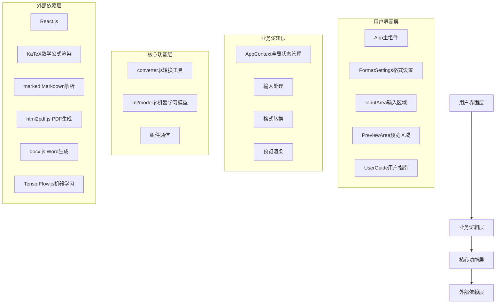

# FormulaFix 项目学习文档

## 1. 项目概述与架构设计

### 1.1 项目概述

FormulaFix 是一款功能强大的 LaTeX/Markdown 转 Word/PDF 工具，专为解决 AI 输出的数学试卷中公式乱码问题而设计。它提供了直观的三栏布局界面，支持多种输入格式，实时预览，以及丰富的转换选项，帮助用户轻松将包含数学公式的文档转换为专业的 Word 或 PDF 格式。

### 1.2 整体架构

FormulaFix 采用现代前端技术栈构建，基于 React.js 框架，使用 Context API 进行状态管理，实现了模块化、组件化的架构设计。项目整体分为以下几个核心层次：



### 1.3 模块关系

1. **用户界面层**：负责与用户交互，展示数据和接收用户输入
   - `App.jsx`：应用主组件，管理三栏布局和组件组合
   - `FormatSettings.jsx`：格式设置组件，处理输出格式和页面设置
   - `InputArea.jsx`：输入区域组件，处理用户输入和文件拖拽
   - `PreviewArea.jsx`：预览区域组件，实时显示转换效果
   - `UserGuide.jsx`：用户指南组件，提供使用说明

2. **业务逻辑层**：处理核心业务逻辑，协调各模块工作
   - `AppContext.jsx`：全局状态管理，存储和共享应用状态
   - 输入处理：解析和处理用户输入的不同格式内容
   - 格式转换：将输入内容转换为Word或PDF格式
   - 预览渲染：实时渲染输入内容，提供预览效果

3. **核心功能层**：实现具体的功能逻辑
   - `converter.js`：文档转换工具，处理不同格式间的转换
   - `ml/model.js`：机器学习模型，用于公式识别和处理
   - 组件通信：实现组件间的数据传递和事件处理

4. **外部依赖层**：提供基础功能支持
   - React.js：构建用户界面
   - KaTeX：渲染数学公式
   - marked：解析Markdown格式
   - html2pdf.js：生成PDF文档
   - docx.js：生成Word文档
   - TensorFlow.js：提供机器学习能力

### 1.4 数据流设计

FormulaFix 采用单向数据流设计，确保数据流动清晰可控：

1. **用户输入** → **InputArea** → **AppContext**：用户在输入区域输入内容，通过Context API更新全局状态
2. **AppContext** → **PreviewArea**：全局状态变化触发预览区域重新渲染
3. **用户操作** → **FormatSettings** → **AppContext**：用户调整格式设置，更新全局状态
4. **AppContext** → **converter.js**：用户点击转换按钮，触发转换逻辑
5. **converter.js** → **AppContext**：转换完成后，更新状态并提供下载链接
6. **AppContext** → **PreviewArea**：预览区域显示转换结果

## 2. 技术栈详解

### 2.1 前端框架

| 技术 | 版本 | 用途 | 说明 |
|------|------|------|------|
| React.js | ^18.2.0 | 构建用户界面 | 使用React 18的Hooks特性，实现组件化开发 |
| React DOM | ^18.2.0 | DOM操作 | 用于将React组件渲染到DOM中 |
| Vite | ^5.2.0 | 构建工具 | 提供快速的开发服务器和高效的构建过程 |

### 2.2 核心库

| 技术 | 版本 | 用途 | 说明 |
|------|------|------|------|
| KaTeX | ^0.16.8 | 数学公式渲染 | 快速渲染LaTeX数学公式，比MathJax更轻量 |
| marked | ^12.0.2 | Markdown解析 | 将Markdown文本解析为HTML |
| html2pdf.js | ^0.12.1 | PDF生成 | 将HTML内容转换为PDF文档 |
| docx.js | ^9.5.1 | Word生成 | 生成Microsoft Word (.docx)文档 |
| TensorFlow.js | ^4.22.0 | 机器学习 | 用于公式识别和处理 |
| mathquill | ^0.10.1-a | 数学公式编辑器 | 提供交互式数学公式编辑功能 |

### 2.3 开发工具

| 工具 | 版本 | 用途 | 说明 |
|------|------|------|------|
| ESLint | ^8.57.0 | 代码检查 | 确保代码质量和一致性 |
| eslint-plugin-react | ^7.34.1 | React代码检查 | 专门针对React代码的检查规则 |
| eslint-plugin-react-hooks | ^4.6.0 | React Hooks检查 | 确保React Hooks的正确使用 |
| gh-pages | ^6.3.0 | 部署工具 | 将应用部署到GitHub Pages |
| @types/react | ^18.2.66 | TypeScript类型定义 | 为React提供TypeScript类型支持 |
| @types/react-dom | ^18.2.22 | TypeScript类型定义 | 为React DOM提供TypeScript类型支持 |

### 2.4 技术选型理由

1. **React.js**：选择React.js作为前端框架，因为它提供了组件化开发模式，便于代码复用和维护，同时拥有丰富的生态系统和活跃的社区支持。

2. **KaTeX**：选择KaTeX作为数学公式渲染库，因为它相比MathJax具有更快的渲染速度和更小的体积，适合实时预览场景。

3. **Context API**：使用React的Context API进行状态管理，避免了引入Redux等复杂状态管理库，适合中小型应用的状态管理需求。

4. **Vite**：选择Vite作为构建工具，因为它提供了快速的开发服务器启动速度和热模块替换功能，大大提升了开发效率。

5. **TensorFlow.js**：引入TensorFlow.js提供机器学习能力，用于更智能地处理和识别数学公式，提升转换质量。

## 3. 文件功能说明

### 3.1 根目录文件

| 文件路径 | 功能说明 | 核心实现 | 关联文件 |
|---------|---------|---------|----------|
| `package.json` | 项目配置文件 | 定义项目依赖、脚本命令和版本信息 | `package-lock.json` |
| `vite.config.js` | Vite构建配置 | 配置Vite构建选项和插件 | - |
| `index.html` | 应用入口HTML | 提供应用挂载点和基础HTML结构 | `src/main.jsx` |
| `README.md` | 项目说明文档 | 提供项目概述和使用说明 | - |
| `LEARNING_DOCUMENT.md` | 学习文档 | 详细的项目学习资料 | - |

### 3.2 入口文件

| 文件路径 | 功能说明 | 核心实现 | 关键函数 | 关联文件 |
|---------|---------|---------|----------|----------|
| `src/main.jsx` | 应用入口文件 | 初始化React应用，渲染根组件 | `ReactDOM.createRoot().render()` | `src/components/App.jsx`、`src/context/AppContext.jsx`、`src/styles/main.css` |

### 3.3 核心组件

| 文件路径 | 功能说明 | 核心实现 | 关键函数 | 关联文件 |
|---------|---------|---------|----------|----------|
| `src/components/App.jsx` | 应用主组件 | 管理三栏布局，协调各组件工作 | `handleMouseDown()`, `handleMouseMove()`, `handleMouseUp()` | `src/components/FormatSettings.jsx`、`src/components/InputArea.jsx`、`src/components/PreviewArea.jsx` |
| `src/components/FormatSettings.jsx` | 格式设置组件 | 提供输出格式、文档模板、页面设置等选项 | `handleTemplateChange()`, `handlePageSizeChange()` | `src/context/AppContext.jsx` |
| `src/components/InputArea.jsx` | 输入区域组件 | 处理用户输入，支持多种输入格式 | `handleInputChange()`, `handleDragOver()`, `handleDrop()` | `src/context/AppContext.jsx` |
| `src/components/PreviewArea.jsx` | 预览区域组件 | 实时显示转换效果，支持多种预览样式 | `handleRefreshPreview()`, `toggleFullscreen()` | `src/context/AppContext.jsx` |
| `src/components/UserGuide.jsx` | 用户指南组件 | 提供应用使用说明和示例 | - | - |

### 3.4 状态管理

| 文件路径 | 功能说明 | 核心实现 | 关键函数 | 关联文件 |
|---------|---------|---------|----------|----------|
| `src/context/AppContext.jsx` | 全局状态管理 | 管理应用状态，提供状态更新方法 | `handleInputChange()`, `handleConvert()`, `toggleDarkMode()` | 所有组件 |

### 3.5 工具函数

| 文件路径 | 功能说明 | 核心实现 | 关键函数 | 关联文件 |
|---------|---------|---------|----------|----------|
| `src/utils/converter.js` | 转换工具 | 实现文档格式转换功能 | `convertToDocx()`, `convertToPdf()`, `processMarkdownWithFormulas()` | `src/components/InputArea.jsx`、`src/components/PreviewArea.jsx` |
| `src/utils/ml/model.js` | 机器学习模型 | 提供公式识别和处理能力 | `loadModel()`, `predict()` | `src/utils/converter.js` |

### 3.6 样式文件

| 文件路径 | 功能说明 | 核心实现 | 关键部分 | 关联文件 |
|---------|---------|---------|----------|----------|
| `src/styles/main.css` | 主样式文件 | 定义应用样式，包括布局、主题等 | CSS变量、响应式布局、夜间模式 | 所有组件 |

### 3.7 测试文件

| 文件路径 | 功能说明 | 核心实现 | 关联文件 |
|---------|---------|---------|----------|
| `test-converter-formulas.js` | 转换功能测试 | 测试公式转换功能 | `src/utils/converter.js` |
| `test-markdown-parsing.js` | Markdown解析测试 | 测试Markdown解析功能 | `src/utils/converter.js` |
| `test-formula-recognition.html` | 公式识别测试 | 测试公式识别功能 | `src/utils/ml/model.js` |

## 4. 开发环境配置指南

### 4.1 环境要求

| 环境 | 版本 | 说明 |
|------|------|------|
| Node.js | ^16.0.0 | JavaScript运行环境 |
| npm | ^7.0.0 | 包管理器 |
| Git | ^2.0.0 | 版本控制工具 |

### 4.2 安装步骤

#### 4.2.1 克隆项目

```bash
# 克隆项目仓库
git clone https://github.com/Thy985/fixmath.git

# 进入项目目录
cd fixmath
```

#### 4.2.2 安装依赖

```bash
# 安装项目依赖
npm install
```

#### 4.2.3 启动开发服务器

```bash
# 启动开发服务器
npm run dev

# 开发服务器默认运行在 http://localhost:5173
```

#### 4.2.4 构建生产版本

```bash
# 构建生产版本
npm run build

# 构建产物将生成在 dist 目录
```

#### 4.2.5 预览生产构建

```bash
# 预览生产构建
npm run preview

# 预览服务器默认运行在 http://localhost:4173
```

#### 4.2.6 部署到GitHub Pages

```bash
# 部署到GitHub Pages
npm run deploy

# 部署完成后，应用将可通过 https://yourusername.github.io/fixmath 访问
```

### 4.3 依赖说明

| 依赖类别 | 依赖名称 | 版本 | 用途 | 安装命令 |
|---------|---------|------|------|----------|
| 核心依赖 | react | ^18.2.0 | React核心库 | `npm install react` |
| 核心依赖 | react-dom | ^18.2.0 | React DOM操作 | `npm install react-dom` |
| 数学公式 | katex | ^0.16.8 | 数学公式渲染 | `npm install katex` |
| 数学公式 | mathquill | ^0.10.1-a | 数学公式编辑器 | `npm install mathquill` |
| 文档处理 | marked | ^12.0.2 | Markdown解析 | `npm install marked` |
| 文档处理 | docx | ^9.5.1 | Word文档生成 | `npm install docx` |
| 文档处理 | html2pdf.js | ^0.12.1 | PDF文档生成 | `npm install html2pdf.js` |
| 机器学习 | @tensorflow/tfjs | ^4.22.0 | TensorFlow.js核心库 | `npm install @tensorflow/tfjs` |
| 构建工具 | vite | ^5.2.0 | 前端构建工具 | `npm install --save-dev vite` |
| 代码检查 | eslint | ^8.57.0 | 代码质量检查 | `npm install --save-dev eslint` |

## 5. 代码规范与最佳实践

### 5.1 编码规范

#### 5.1.1 JavaScript/React 规范

1. **文件命名**：使用 PascalCase 命名组件文件（如 `App.jsx`），使用 camelCase 命名工具函数文件（如 `converter.js`）。

2. **组件命名**：组件名称使用 PascalCase，与文件名保持一致。

3. **变量命名**：使用 camelCase 命名变量和函数，使用 UPPERCASE_SNAKE_CASE 命名常量。

4. **函数命名**：使用动词开头的 camelCase 命名函数，如 `handleInputChange()`、`toggleDarkMode()`。

5. **注释规范**：
   - 使用 JSDoc 格式为函数添加文档注释
   - 为复杂逻辑添加行内注释
   - 为组件添加用途说明

6. **代码风格**：
   - 使用 2 个空格进行缩进
   - 使用单引号或反引号，避免使用双引号
   - 每行代码长度不超过 120 个字符
   - 使用分号结束语句

7. **React 最佳实践**：
   - 使用函数组件和 Hooks
   - 避免在渲染过程中创建函数
   - 使用 `useCallback` 和 `useMemo` 优化性能
   - 使用 `React.StrictMode` 进行开发

#### 5.1.2 CSS 规范

1. **命名规范**：使用 kebab-case 命名 CSS 类和 ID。

2. **CSS 变量**：使用 CSS 变量定义颜色、间距等共用样式值。

3. **选择器**：优先使用类选择器，避免使用 ID 选择器和标签选择器。

4. **样式组织**：按功能模块组织样式，使用注释分隔不同模块。

5. **响应式设计**：使用媒体查询实现响应式布局，优先使用 Flexbox 和 Grid。

### 5.2 开发流程

1. **分支管理**：
   - `master`：主分支，用于发布生产版本
   - `develop`：开发分支，用于集成新功能
   - `feature/*`：功能分支，用于开发新功能
   - `bugfix/*`：修复分支，用于修复 bug

2. **提交规范**：
   - 提交信息使用中文，简洁明了
   - 提交信息格式：`[模块名] 功能描述`
   - 每个提交只包含一个功能或修复

3. **代码审查**：
   - 提交 Pull Request 前进行自我审查
   - 确保代码符合规范，功能正常
   - 提供清晰的 PR 描述，说明变更内容和原因

4. **测试流程**：
   - 开发新功能时编写相应的测试用例
   - 提交代码前运行测试，确保无回归问题
   - 定期运行完整的测试套件

### 5.3 性能优化

1. **渲染优化**：
   - 使用 React.memo 缓存组件
   - 使用 useCallback 和 useMemo 缓存函数和计算结果
   - 避免不必要的重渲染

2. **资源优化**：
   - 懒加载大型依赖库
   - 优化图片和静态资源
   - 使用代码分割减小 bundle 体积

3. **网络优化**：
   - 使用 CDN 加载第三方库
   - 启用 gzip 压缩
   - 优化 API 请求

4. **用户体验优化**：
   - 使用防抖和节流优化用户输入
   - 提供加载状态和错误反馈
   - 优化动画性能

### 5.4 安全最佳实践

1. **输入验证**：
   - 验证所有用户输入
   - 防止 XSS 攻击
   - 处理特殊字符

2. **依赖管理**：
   - 定期更新依赖库，修复安全漏洞
   - 使用 npm audit 检查依赖安全

3. **代码安全**：
   - 避免使用 eval() 和 Function() 构造函数
   - 安全处理本地存储
   - 保护敏感信息

4. **错误处理**：
   - 使用 try-catch 捕获异常
   - 提供友好的错误提示
   - 记录错误日志

## 6. 项目扩展与未来规划

### 6.1 功能扩展

1. **输入格式扩展**：
   - 支持 AsciiMath、MathML、HTML 等格式
   - 提供文件导入功能，支持多种文件格式

2. **输出格式增强**：
   - 支持 EPUB、HTML5、图片格式等
   - 提供更多自定义输出选项

3. **模板系统升级**：
   - 自定义模板编辑器
   - 在线模板库
   - 模板预览功能

### 6.2 技术升级

1. **框架升级**：
   - 升级到 React 19
   - 使用 Vite 6 新特性

2. **状态管理**：
   - 考虑使用 Zustand 或 Jotai 替代 Context API
   - 优化状态管理结构

3. **构建优化**：
   - 使用 SWC 进行代码编译
   - 优化构建配置

### 6.3 平台扩展

1. **移动应用**：
   - 使用 React Native 开发跨平台移动应用
   - 提供离线功能

2. **桌面应用**：
   - 使用 Electron 包装为桌面应用
   - 提供系统集成功能

3. **浏览器扩展**：
   - 开发浏览器插件
   - 提供网页公式编辑功能

## 7. 快速上手指南

### 7.1 基本使用流程

1. **启动应用**：
   - 运行 `npm run dev` 启动开发服务器
   - 打开浏览器访问 http://localhost:5173

2. **输入内容**：
   - 在中间输入区域选择输入格式（Markdown、LaTeX、纯文本）
   - 输入或粘贴内容，支持拖拽文件

3. **设置选项**：
   - 在左侧格式设置区域选择输出格式（Word、PDF）
   - 选择文档模板、页面设置和转换选项

4. **预览效果**：
   - 在右侧预览区域查看实时效果
   - 切换预览样式，调整缩放比例

5. **开始转换**：
   - 点击左侧的"开始转换"按钮
   - 转换完成后，点击右侧的"导出"按钮下载文件

### 7.2 常见问题

1. **公式渲染问题**：
   - 确保使用正确的公式语法
   - 检查公式是否被正确包围（如 `$` 或 `$$`）

2. **转换失败**：
   - 检查输入内容是否包含特殊字符
   - 确保网络连接正常

3. **性能问题**：
   - 对于大型文档，考虑分段处理
   - 关闭不必要的浏览器标签

4. **样式问题**：
   - 检查浏览器兼容性
   - 清除浏览器缓存

### 7.3 开发技巧

1. **组件开发**：
   - 使用 `npm run dev` 启动开发服务器，支持热更新
   - 使用 React Developer Tools 调试组件

2. **样式开发**：
   - 使用浏览器开发者工具实时调整样式
   - 利用 CSS 变量实现主题切换

3. **调试技巧**：
   - 使用 `console.log()` 打印调试信息
   - 使用断点调试复杂逻辑

4. **性能分析**：
   - 使用 Chrome DevTools 的 Performance 面板分析性能
   - 使用 React DevTools 的 Profiler 分析组件渲染

## 8. 总结

FormulaFix 是一个功能完整、架构清晰的 LaTeX/Markdown 转 Word/PDF 工具，它通过现代化的前端技术栈和模块化的架构设计，为用户提供了便捷、高效的文档转换解决方案。

本学习文档详细介绍了项目的整体架构、技术栈、文件功能、开发环境配置和代码规范，旨在帮助新团队成员快速熟悉项目并开展开发工作。通过遵循文档中的最佳实践和开发流程，团队可以保持代码质量，提高开发效率，不断完善和扩展项目功能。

FormulaFix 项目不仅解决了实际问题，也展示了如何使用现代前端技术构建一个功能完整的应用，是学习前端开发的优秀案例。

---

**FormulaFix 项目团队**

*最后更新时间：2026年1月15日*